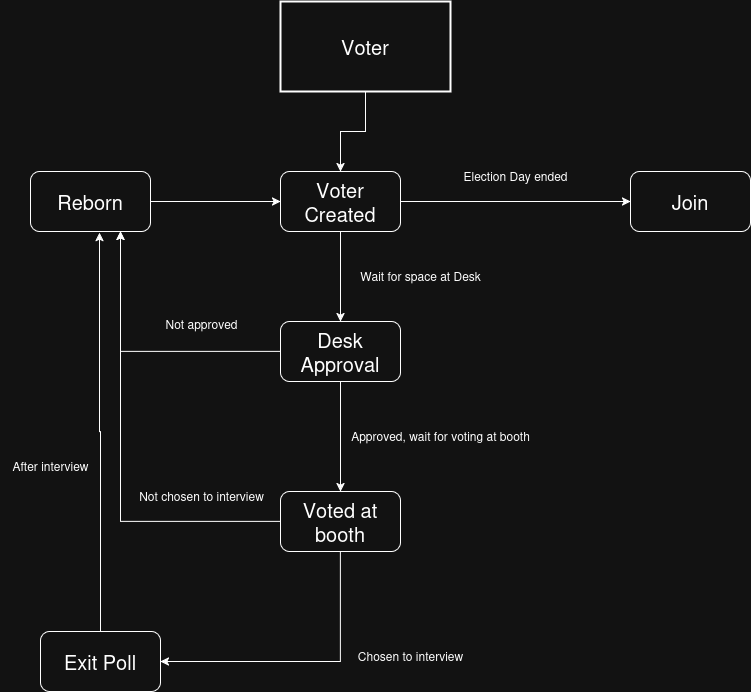
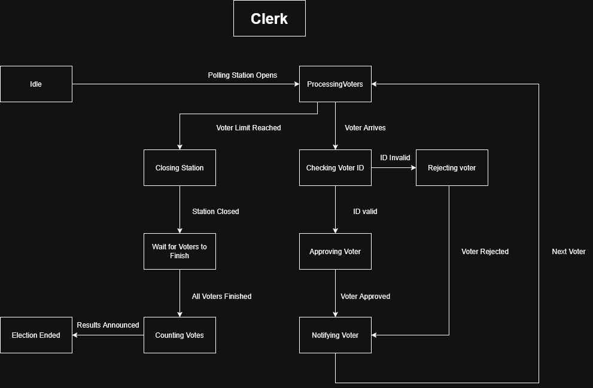
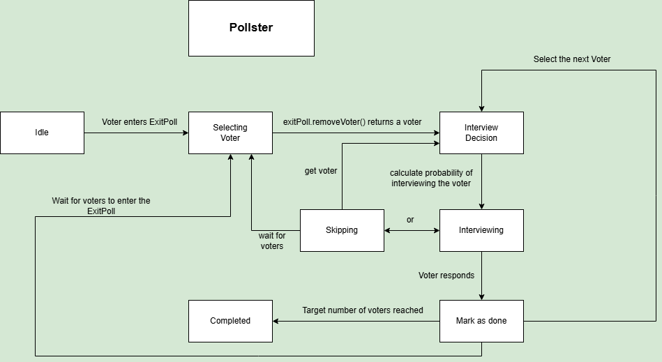

# SD practical assignment

This project aims at the development of a Producer-Consumer project simulating an Election Day, where there exists Voters, Poll Clerk (who's going to check for Voter ID's and identify Voters who voted) and Pollster, who is going to select specific Voters to interview after their voting.

This project was made in Java using an OOP approach and synchronism (monitors) and has a GUI in Swing.

## Run

Compile using

```bash
javac *.java
```

Then run Main

```bash
java Main
```

## Architecture

### Passive Entities

- PollingStation: Represents the station for voting
- Desk: Part of the PollingStation, where the PollClerk does ID checking
- VotingBooth: Part of the PollingStation, where Voters cast their votes
- ExitPoll: For holding voters to be interviewed by the Pollster
- ElectionResults: Aids at counting and displaying votes
- Logger: for logging messages into a log file
- MyArrayList, GenericFIFO: data structures


### Active Entities 






